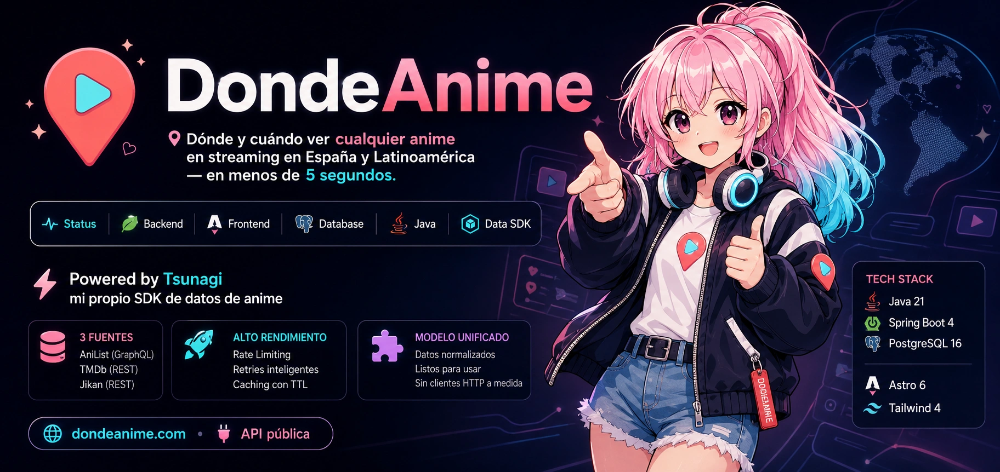
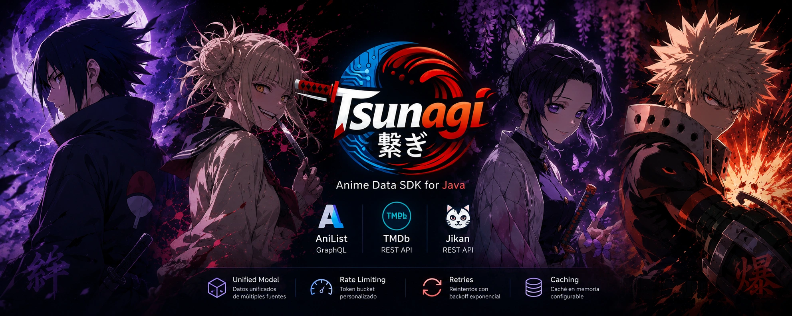

<div align="center">

<a href="https://dondeanime.com"></a>

# DondeAnime

**Dónde y cuándo ver cualquier anime en streaming en España y Latinoamérica — en menos de 5 segundos.**

[](https://dondeanime.com)
[](#stack-técnico)
[](#stack-técnico)
[](#stack-técnico)
[](#stack-técnico)
[](https://central.sonatype.com/artifact/io.github.diegoalegil/tsunagi)

🌐 **[dondeanime.com](https://dondeanime.com)**  ·  🔌 **[API pública](https://api.dondeanime.com/api/anime)**

</div>

---

## Qué es

Web pública en español que responde dos preguntas concretas para cualquier anime:

1. **¿Está disponible en mi país?**
2. **¿En qué plataforma de streaming legal puedo verlo?**

No es un wiki ni un foro. Es un buscador rápido orientado a SEO long-tail con páginas estáticas indexables por país, plataforma, género y temporada. Cubre los 5 mercados hispanohablantes principales (España, México, Argentina, Chile, Colombia) y las plataformas relevantes (Crunchyroll, Netflix, Prime Video, HBO Max, Disney+, Apple TV+, Hulu, Pluto TV).

---

## ⚡ Powered by Tsunagi — mi propio SDK de datos de anime

<div align="center">



</div>

La capa de datos de DondeAnime no usa clientes HTTP a medida: corre sobre **[Tsunagi](https://github.com/diegoalegil/tsunagi)**, un SDK de anime para Java que **escribí desde cero y publiqué en Maven Central**, libre para que lo use cualquiera.

```xml
<dependency>
    <groupId>io.github.diegoalegil</groupId>
    <artifactId>tsunagi</artifactId>
    <version>1.3.0</version>
</dependency>
```

| | Capacidad |
|---|---|
| 🧩 **Unified Model** | Modelo de datos unificado sobre múltiples fuentes |
| 🌐 **3 fuentes** | **AniList** (GraphQL) · **TMDb** (REST) · **Jikan** (REST) |
| 🚦 **Rate Limiting** | Token bucket configurable por cliente |
| 🔁 **Retries** | Reintentos con backoff exponencial sobre fallos transitorios |
| 🗃️ **Caching** | Caché en memoria con TTL y evicción LRU |

DondeAnime consume `AniListClient.fetchPopular(...)` para el catálogo y `TmdbClient` para watch-providers, trailers y descripciones localizadas — toda la **política de negocio** (países, idiomas, slugs, mapeo JPA) se queda en DondeAnime; Tsunagi solo aporta los datos crudos.

> **Cruce AniList ↔ TMDb:** el matching de cada anime con su entrada en TMDb lo resuelve **[anime-title-matcher](https://github.com/diegoalegil/anime-title-matcher)**, otra librería propia: similitud difusa de títulos (Levenshtein + Jaro-Winkler + token-set), normalización de temporadas/numerales y veto serie-vs-película, todo explicable.

> **Noticias:** la ingesta de feeds RSS/Atom de noticias de anime corre sobre **[anime-feed-parser](https://github.com/diegoalegil/anime-feed-parser)**, una tercera librería propia en Maven Central: parser RSS 2.0/Atom sin dependencias, XML seguro anti-XXE, fetch que sigue redirects y deduplicación por URL canónica.

📦 Tres librerías propias en Maven Central: **[Tsunagi](https://central.sonatype.com/artifact/io.github.diegoalegil/tsunagi)** (datos) · **[anime-title-matcher](https://github.com/diegoalegil/anime-title-matcher)** (matching) · **[anime-feed-parser](https://central.sonatype.com/artifact/io.github.diegoalegil/anime-feed-parser)** (noticias)

---

## Cifras actuales

| Métrica | Valor |
|---|---|
| Anime catalogados | ~930 en producción (infraestructura lista hasta 1000) |
| Páginas estáticas | Programmatic SEO — miles de páginas (anime, país, plataforma, género, temporada) |
| Países soportados | 5 (ES, MX, AR, CL, CO) |
| Idiomas | Español + Inglés (`/en/`) |
| Plataformas indexadas | 8+ |
| Capa de datos | **Tsunagi 1.3.0** (SDK propio en Maven Central) |
| Ingesta de noticias | **anime-feed-parser 1.0.1** (librería propia en Maven Central) |
| Tests backend | 391 (verdes en CI con Postgres + Testcontainers) |
| Endpoints REST | ~25 (catálogo, búsqueda fulltext, API v1, premium, push, listas) |
| Sync automático | AniList 12h · TMDb match (title-matcher) 24h · Providers 24h |

> Nota de estado: la rama `main` contiene 20+ sprints de features. El backend en
> producción se actualiza por **deploy manual** al VPS, así que algunas capacidades
> recién mergeadas (p. ej. el title-matcher sobre Tsunagi 1.3.0) se activan en
> producción con el siguiente deploy.

---

## Stack técnico

### Backend
- **Java 21** + **Spring Boot 4.0.x**
- **Hibernate 7** sobre Spring Data JPA
- **PostgreSQL 16** (en Docker tanto local como producción), migraciones con **Flyway**
- **[Tsunagi](https://github.com/diegoalegil/tsunagi)** (SDK propio) como capa de acceso a AniList / TMDb / Jikan
- **[anime-title-matcher](https://github.com/diegoalegil/anime-title-matcher)** (librería propia) para el cruce difuso AniList ↔ TMDb
- **[anime-feed-parser](https://github.com/diegoalegil/anime-feed-parser)** (librería propia) para la ingesta RSS/Atom de noticias
- **Jackson 3.x** (paquetes `tools.jackson.*` propios de Spring Boot 4)
- **Spring Security** (JWT admin + 2FA TOTP en `/api/admin/**`, tokens JWT para flujos públicos)
- **Resend** para email transaccional

### Frontend
- **Astro 6** + **Tailwind 4** (build estático puro, SEO-first)
- **Geist** auto-hospedada
- JSON-LD (`TVSeries`, `BreadcrumbList`, `WebSite+SearchAction`, `ItemList`)
- Tema dark/light persistente
- Buscador in-memory contra `search-index.json`

### Infraestructura
- **Hetzner CX22** (Ubuntu + Docker + Caddy con Let's Encrypt automático)
- **Vercel** free tier para el frontend estático
- **Cloudflare** para DNS, proxy, Email Routing
- **Cloudflare R2** para backups diarios automatizados de Postgres (cron + rotación 30 días)
- **GitHub Actions** para CI (backend tests + frontend build + e2e + lighthouse)

### Fuentes de datos
- **AniList** (GraphQL, sin auth) — metadata de anime
- **TMDb** (REST + API key v4) — providers de streaming por país, trailers, descripciones
- **Jikan** (REST) — fallback disponible vía Tsunagi

> Acceso encapsulado en **Tsunagi**; DondeAnime no habla HTTP con estas APIs directamente.

---

## Arquitectura

```
┌─────────────────┐         ┌──────────────────┐
│   Cloudflare    │─DNS────▶│      Vercel      │
│   (proxy/CDN)   │         │  (Astro estático)│
└────────┬────────┘         └────────┬─────────┘
         │                           │
         │ api.dondeanime.com        │ fetch (build time)
         ▼                           ▼
┌─────────────────────────────────────────────┐
│           Hetzner VPS CX22                  │
│  ┌──────────┐  ┌────────────┐  ┌────────┐   │
│  │  Caddy   │─▶│  Backend   │─▶│Postgres│   │
│  │  (SSL)   │  │ Spring 4   │  │   16   │   │
│  └──────────┘  └─────┬──────┘  └────────┘   │
│                      │ vía Tsunagi (SDK)    │
└──────────────────────┼──────────────────────┘
                       │
            ┌──────────┼──────────┐
            ▼          ▼          ▼
       ┌────────┐ ┌────────┐ ┌────────┐
       │AniList │ │ TMDb   │ │ Resend │
       │GraphQL │ │ REST   │ │ Email  │
       └────────┘ └────────┘ └────────┘
```

El scheduler dentro del backend dispara los syncs periódicos. Tras cada sync de providers se llama un Deploy Hook de Vercel para rebuildear el frontend con datos frescos.

---

## Estructura del repo

```
DondeAnime/
├── README.md                          ← Estás aquí
├── DEPLOY.md                          ← Operación producción
├── docker-compose.yml                 ← Postgres local (puerto 5433)
├── docker-compose.prod.yml            ← Stack producción (3 servicios + Caddyfile)
├── Caddyfile                          ← Reverse proxy + SSL
├── .env.example                       ← Plantilla variables locales
├── backend/                           ← Spring Boot 4
│   ├── pom.xml                        ← Depende de io.github.diegoalegil:tsunagi
│   ├── src/main/java/com/dondeanime/backend/
│   │   ├── admin/                     ← Auth 2FA + overrides editoriales
│   │   ├── alerts/                    ← Email alerts (doble opt-in JWT)
│   │   ├── affiliate/                 ← Tracking links afiliados
│   │   ├── anime/                     ← Entidad central + sync + matching (datos vía Tsunagi)
│   │   ├── config/                    ← Beans de Tsunagi y del title-matcher
│   │   ├── provider/                  ← Watch providers por país
│   │   ├── scheduling/                ← Jobs @Scheduled
│   │   └── sitemap/                   ← Datos para sitemap.xml
│   └── src/main/resources/
│       ├── application.properties     ← Config base (dev local)
│       ├── application-prod.properties ← Overrides para prod
│       └── db/migration/              ← Migraciones Flyway
├── frontend/                          ← Astro 6 + Tailwind 4
│   └── src/
│       ├── pages/                     ← Rutas SSG (anime/[slug], pais/[slug], plataforma/...)
│       ├── components/                ← Componentes Astro
│       ├── lib/                       ← Helpers (api, countries, platforms, seo)
│       └── layouts/                   ← BaseLayout
├── scripts/                           ← Validación de APIs y utilidades
└── docs/                              ← Brief, arquitectura, APIs, assets
```

---

## Arranque local

### Requisitos

- Docker Desktop
- Java 21 (Temurin recomendado)
- Node.js 20+
- Cuenta TMDb con [API key v4](https://www.themoviedb.org/settings/api)

### Setup

```bash
# Clonar
git clone https://github.com/diegoalegil/dondeanime.git
cd dondeanime

# Variables de entorno
cp .env.example .env
# Editar .env y meter TMDB_API_KEY real

# Arrancar Postgres (puerto host 5433, evita colisión con Postgres nativo si lo tienes)
docker compose up -d

# Backend (puerto 8080)
cd backend
./mvnw spring-boot:run

# En otra terminal: frontend (puerto 4321)
cd frontend
npm install
npm run dev
```

Primera ingesta de datos (los endpoints de sync requieren JWT admin;
en local las credenciales por defecto son `admin`/`admin`):

```bash
ADMIN_TOKEN=$(curl -s -X POST http://localhost:8080/api/admin/login \
  -H 'Content-Type: application/json' \
  -d '{"username":"admin","password":"admin"}' | jq -r '.token')

curl -X POST -H "Authorization: Bearer $ADMIN_TOKEN" "http://localhost:8080/api/anime/sync?count=100"
curl -X POST -H "Authorization: Bearer $ADMIN_TOKEN" http://localhost:8080/api/anime/match
curl -X POST -H "Authorization: Bearer $ADMIN_TOKEN" http://localhost:8080/api/anime/sync-providers
curl -X POST -H "Authorization: Bearer $ADMIN_TOKEN" http://localhost:8080/api/anime/sync-trailers
```

Tarda unos minutos. Al terminar tienes el catálogo con providers reales y trailers cuando TMDb los expone.

### Tests

> **Requiere Docker en marcha.** Los tests de integración usan Testcontainers,
> que arranca un Postgres efímero. Sin el daemon de Docker, esos tests fallan.
> En CI ya hay Docker disponible.

```bash
cd backend
./mvnw verify
```

---

## Endpoints REST principales

| Método | Endpoint | Descripción |
|---|---|---|
| GET | `/api/anime` | Lista catálogo completo |
| GET | `/api/anime/{slug}` | Detalle de anime con providers por país |
| POST | `/api/anime/sync-trailers` | Sincroniza trailers de YouTube desde TMDb |
| GET | `/api/providers` | Lista plataformas (filtro por `?country=ES`) |
| GET | `/api/providers/{slug}/{country}` | Anime disponibles en plataforma+país |
| GET | `/api/genres` y `/api/genres/{slug}` | Géneros con listado |
| GET | `/api/seasons` y `/api/seasons/{year}/{season}` | Temporadas |
| GET | `/api/sitemap` | Todos los slugs/ids para generar sitemap.xml |
| POST | `/api/track/affiliate` | Tracking público de clicks afiliados |
| POST | `/api/admin/anime/{slug}/override` | (Auth) Override editorial de un campo |
| GET | `/api/admin/anime/matching/dry-run` | (Auth) Dry-run del title-matcher sobre el catálogo |

Lista completa en los controladores REST de `backend/src/main/java/com/dondeanime/backend/`.

---

## Producción

Operación documentada en [`DEPLOY.md`](./DEPLOY.md). Comandos rápidos:

```bash
# Acceso al VPS
ssh deploy@<ip-vps>

# Logs
docker compose -f docker-compose.prod.yml logs -f backend

# Sync manual (requiere JWT admin, ver DEPLOY.md "Disparar sync manual")
curl -X POST -H "Authorization: Bearer $ADMIN_TOKEN" https://api.dondeanime.com/api/anime/sync

# Backup manual (cron cada 6 horas ya configurado)
/opt/dondeanime/scripts/backup-postgres-r2.sh
```

---

## Roadmap

| Fase | Estado |
|---|---|
| Backend funcional + catálogo | Completado |
| Frontend SEO + deploy producción + SSL + scheduler | Completado |
| Panel admin + overrides editoriales | Mergeado |
| Alertas email con doble opt-in (Resend) | Mergeado |
| Monetización afiliados + AdSense | Mergeado |
| Búsqueda fulltext · API v1 · Premium · push · listas | Mergeado |
| Migración de la capa de datos a Tsunagi (SDK propio) | Mergeado |
| Tsunagi 1.2.0 + cruce AniList↔TMDb con title-matcher | Mergeado |
| News Engine (noticias frescas para Top Stories) | En curso |

---

## Filosofía del proyecto

1. **Velocidad sobre completitud.** Mejor un catálogo bien presentado y al día que decenas de miles con datos rancios.
2. **SEO-first.** Cada decisión técnica considera el impacto en posicionamiento orgánico.
3. **Datos verificados en el top.** El top se enriquece con texto editorial propio. El resto se queda automático.
4. **Sin humo.** Sin cookies superfluas, sin newsletters spam, sin pop-ups, sin oscurecer la pantalla con ads.
5. **Honestidad de afiliados.** Footer + `/legal/afiliados` declaran la relación. Sin trampas.

---

## Licencia

Código público en GitHub. Todos los derechos reservados — no es open source.

(La capa de datos sí es libre: [Tsunagi](https://github.com/diegoalegil/tsunagi) está publicada bajo MIT en Maven Central.)

---

## Autor

[@diegoalegil](https://github.com/diegoalegil) — Estudiante DAM, España.

Proyecto diseñado y desarrollado por Diego Gil: arquitectura, modelo de datos, estrategia SEO, monetización y el SDK de datos ([Tsunagi](https://github.com/diegoalegil/tsunagi)) propios.
